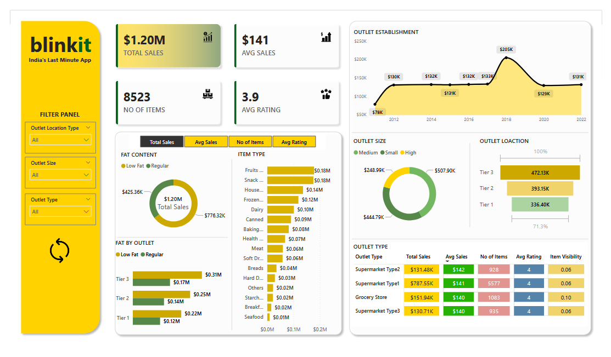

# Blinkit-Sales-Analysis-Dashboard
## Objective
A comprehensive Power BI dashboard analyzing Blinkit's sales performance, customer satisfaction, and inventory distribution.

## Dataset used here
- <a href="https://github.com/KrrishKoulia/Blinkit-Sales-Analysis-Dashboard/blob/main/Blinkit-Dashboard.xlsx">Blinkit-Dashboard</a>

## Overview
This project provides actionable insights into sales trends, product performance, and outlet efficiency using interactive visualizations and calculated KPIs.

## **Business Objectives**
- Analyze total sales, average sales, number of items, and average ratings.
- Visualize sales by fat content, item type, outlet, and establishment age.
- Support data-driven decisions for inventory and sales optimization.

## **KPIs Tracked**
- **Total Sales**
- **Average Sales**
- **Number of Items**
- **Average Rating**

## Dashboard Interaction here
- <a href="https://github.com/KrrishKoulia/Blinkit-Sales-Analysis-Dashboard/blob/main/Blinkit-Dashboard.pbix">Blinkit-Dashboard</a>

## **Charts Included**
1. Total Sales by Fat Content (Donut Chart)
2. Total Sales by Item Type (Bar Chart)
3. Fat Content by Outlet (Stacked Column Chart)
4. Total Sales by Outlet Establishment (Line Chart)

## **Tools & Technologies**
- Power BI Desktop
- DAX for calculations
- Data Modeling & Transformation
